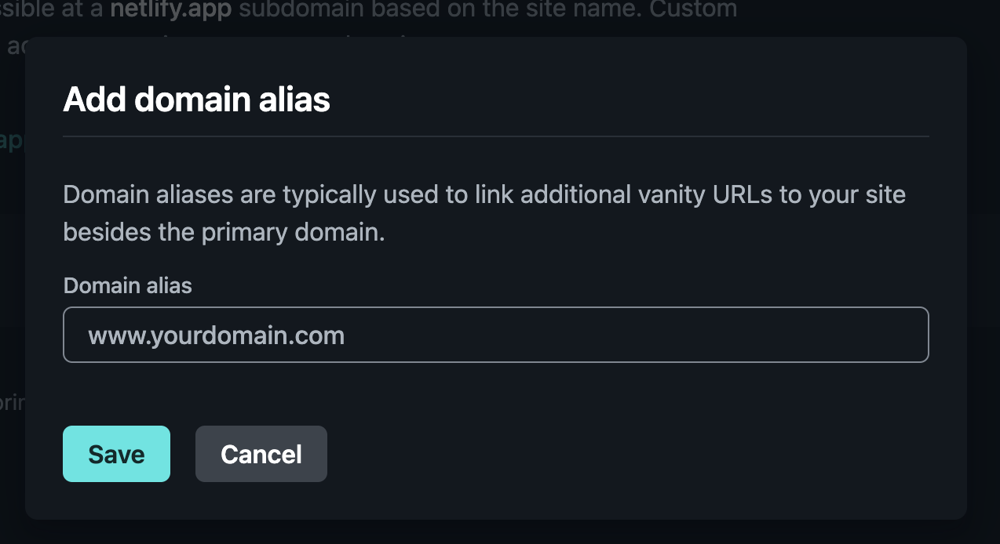

# Netlify Deployment

First, you'll need to have this project hosted on your own GitHub repository, either by forking this repository, or clone and push it to your repository.
```shell
git clone https://github.com/revou-fsse-oct24/milestone-1-dang0ta
```

Next, we can import the project on Netlify, and have it automatically manage the deployment. Open [Netlify](https://app.netlify.com/), login into your account. In the main dashboard, click "Add new site", and choose "import and existing project".
Choose GitHub, since we've hosted the project on GitHub Repository.


After that, you'll be redirected to a page with a list of public repository, choose the one that you've created for this project. On the next page, review the default configuration, and fill in the site name. Make sure the site name is unique!


Once done, click on the Deploy button, Netlify will handle all the deployment needed for this website, and provide a public URL for you to access it.

## Register Custom Domain
Assuming you've already purchased a custom domain, you can register the domain for the website you've just deployed! Open your Netlify Dashboard for the website, and open "Domain Management" page. On "Production domains" section, click "Add domain alias" button, and type in your domain name.


And that's it! In some cases, you might want to configure your custom domain for this to work, you can either point the `nameserver` of your domain to Netlify, or add `A` and `CNAME` custom record to your domain, and point it to the live website address. Netlify will provide you with informations you need to do this.